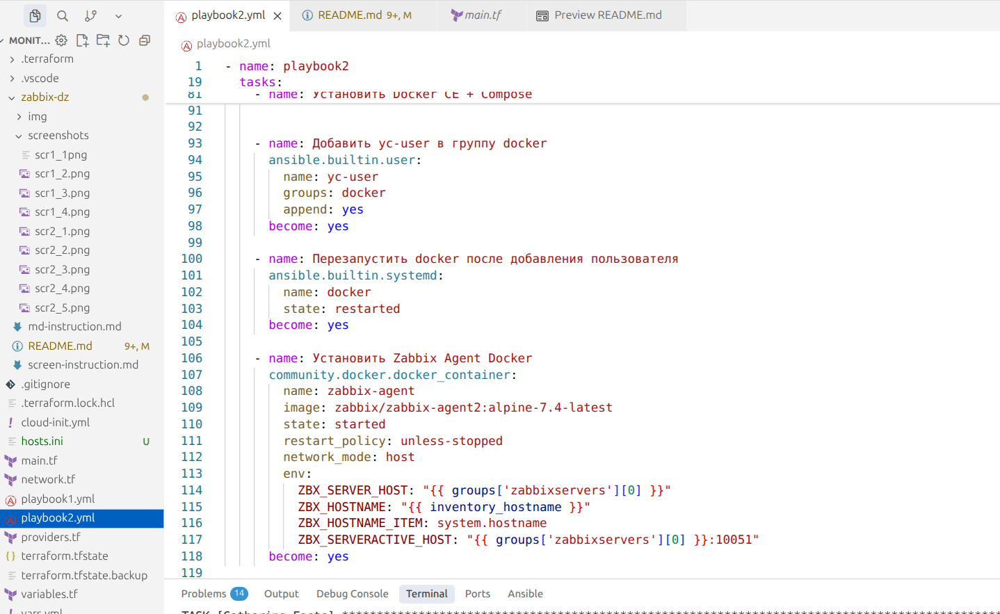
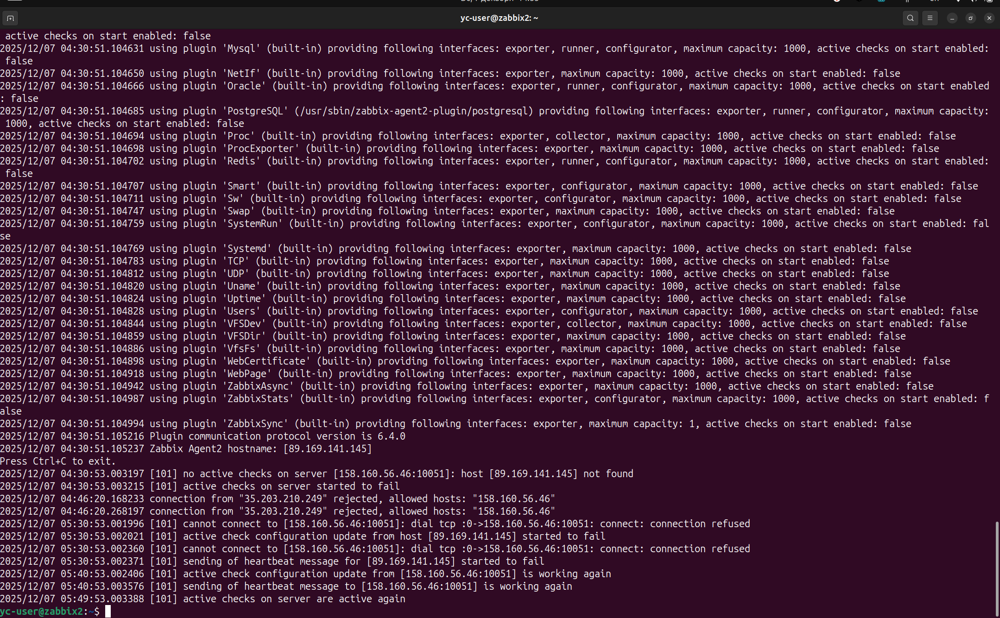
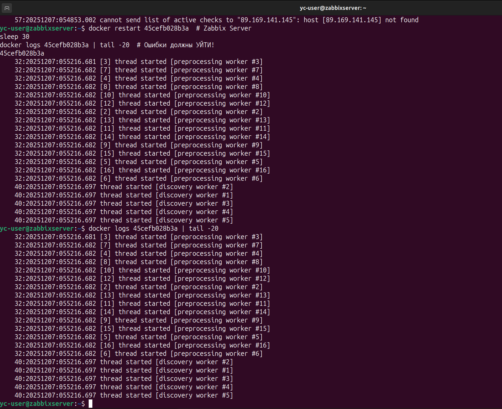
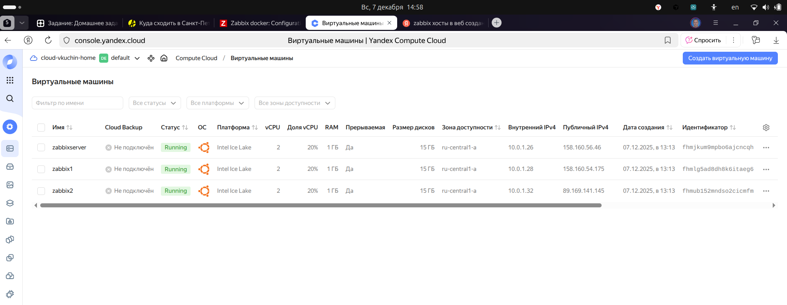
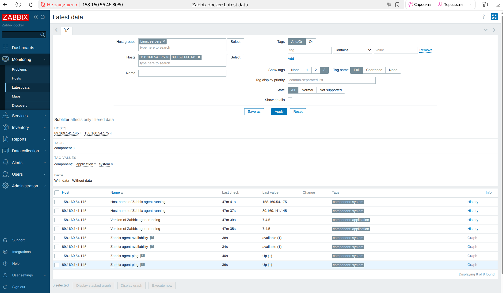
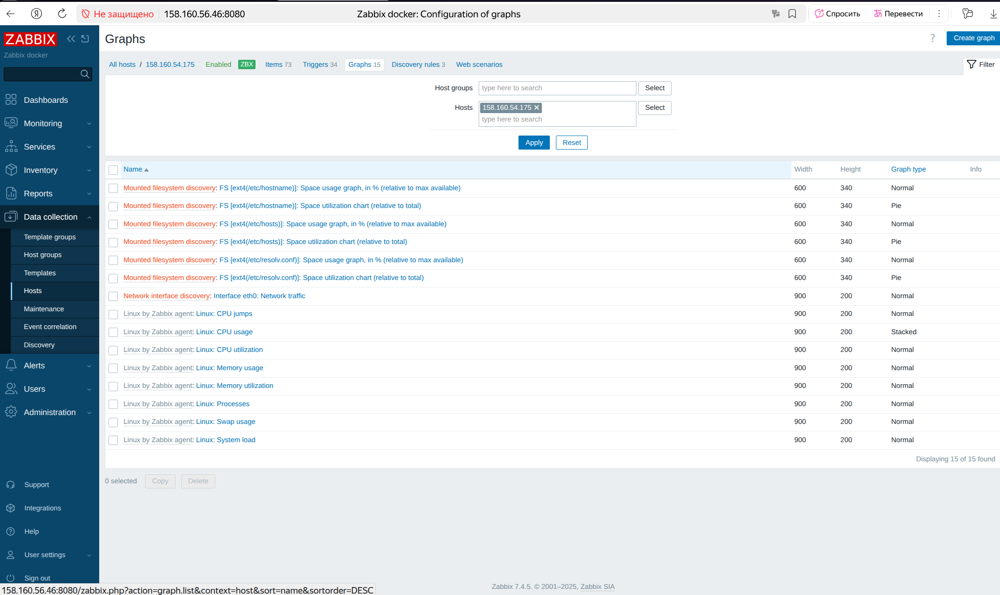
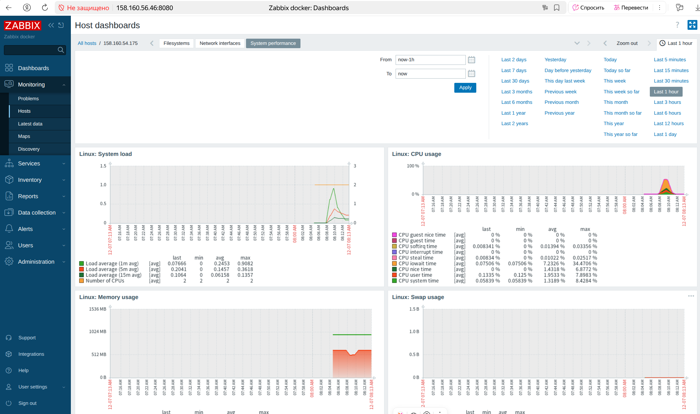

# Домашнее задание к занятию "Система мониторинга Zabbix" - Кучин Виталий

### Инструкция по выполнению домашнего задания

   1. Сделайте `fork` данного репозитория к себе в Github и переименуйте его по названию или номеру занятия, например, https://github.com/имя-вашего-репозитория/git-hw или  https://github.com/имя-вашего-репозитория/7-1-ansible-hw).
   2. Выполните клонирование данного репозитория к себе на ПК с помощью команды `git clone`.
   3. Выполните домашнее задание и заполните у себя локально этот файл README.md:
      - впишите вверху название занятия и вашу фамилию и имя
      - в каждом задании добавьте решение в требуемом виде (текст/код/скриншоты/ссылка)
      - для корректного добавления скриншотов воспользуйтесь [инструкцией "Как вставить скриншот в шаблон с решением](https://github.com/netology-code/sys-pattern-homework/blob/main/screen-instruction.md)
      - при оформлении используйте возможности языка разметки md (коротко об этом можно посмотреть в [инструкции  по MarkDown](https://github.com/netology-code/sys-pattern-homework/blob/main/md-instruction.md))
   4. После завершения работы над домашним заданием сделайте коммит (`git commit -m "comment"`) и отправьте его на Github (`git push origin`);
   5. Для проверки домашнего задания преподавателем в личном кабинете прикрепите и отправьте ссылку на решение в виде md-файла в вашем Github.
   6. Любые вопросы по выполнению заданий спрашивайте в чате учебной группы и/или в разделе “Вопросы по заданию” в личном кабинете.
   
Желаем успехов в выполнении домашнего задания!
   
### Дополнительные материалы, которые могут быть полезны для выполнения задания

1. [Руководство по оформлению Markdown файлов](https://gist.github.com/Jekins/2bf2d0638163f1294637#Code)

---

### Задание 1

Создал в инфраструктуру в Яндекс Облаке при помощи terraform.  
При помощи ansible playbook состоящую из сети, сетевых групп безопасности чтобы открыть порты, одной ВМ - сервера для Zabbix  
Развернул в контейнерах PostgresSQL, Zabbix Server, Zabbix WEB Apache PGSQL.
Web интерфейс zabbix сервера работает на порте 8080.  
Залогинился Admin/zabbix.   

Скриншоты.  
  
  
  
  

---

### Задание 2

Добавил в main.tf еще два клиента на которые собираюсь установить zabbix агенты.  
Создал playbook2.yml для работы отдельно с клиентами.  
Развернул через контейнеры на обеих машинах zabbix агентов.  
ОТкрыл порт 10050 в network.tf.

 *** РЕЗУЛЬТАТЫ ПРОВЕРКИ ***  

Сергей Михалёв
преподаватель
7 декабря 2025 00:17
Добрый вечер, Виталий.

Спасибо за решение.

У вас есть проблема в логах агента:
no active checks on server [89.169.156.169:10051]: host [158.160.50.59] not found

Видно что агент представляется так: Zabbix Agent2 hostname: [158.160.50.59] но сервер отвечает: host [158.160.50.59] not found. Нужно указать адрес сервера в конфиге агента.

Попрошу исправить.

 *** ДОРАБОТКА ***  

1) Адрес сервера zabbix задаётся для обоих клиентов одинаково в playbook2.yml при создании контейнера с агентом в виде ZBX_HOSTNAME: "{{ inventory_hostname }}".  
2) При добавлении в список опрашиваемых хостов на сервере zabbix при помощи web интерфейса я вначалае не разобрался где брать template и не указал его для машин zabbix1, zabbix2, в связи с чем хосты были видны в списке опрашиваемых, находились в состоянии Enabled,но были серого цвета и параметры с них не мониторились.  
Поcле добавления шаблонов "Для мониторинга самих же агентов zabbix" результаты опроса появились в Latest Data.
3) Развернул инфраструктуру при помощи terraform заново. IP адреса теперь другие.  
4) Выполнил Create Host.
5) Указал имена хостов в формате IP, так как они указаны у меня в hosts.ini . Ранее я указывал их как zabbix1 и zabbix2, поэтому обмена между сервером и агентами н происходило.  
6) Ранее пассииные проверки были успешными, а активные нет. Теперь "данные пошли". Связь наладилась. Логи приложил как с сервера так и с клмента.  
6) Выбрал другие templates (активные) вместо "Zabbix agent".   

Скриншоты.  
  
  
  
  
  

 *** Дополнительные скриншоты  ***

  
  
  
  
  
  
  
  
---

### Задание 3

Не выполнено.
