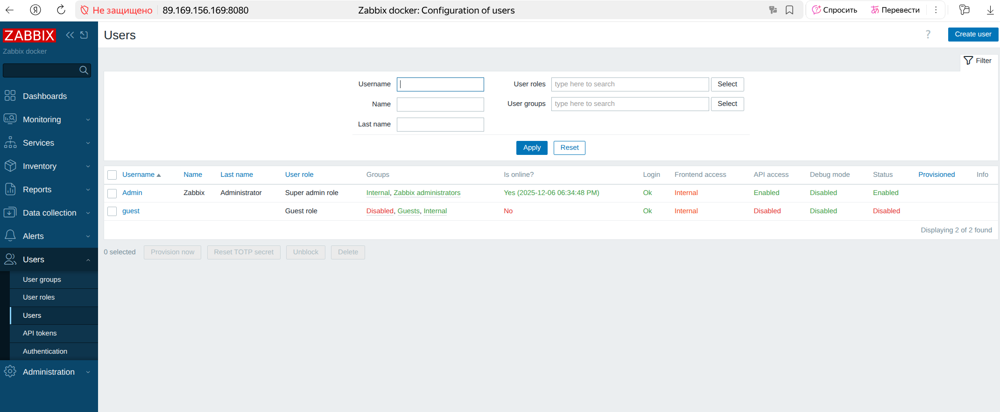
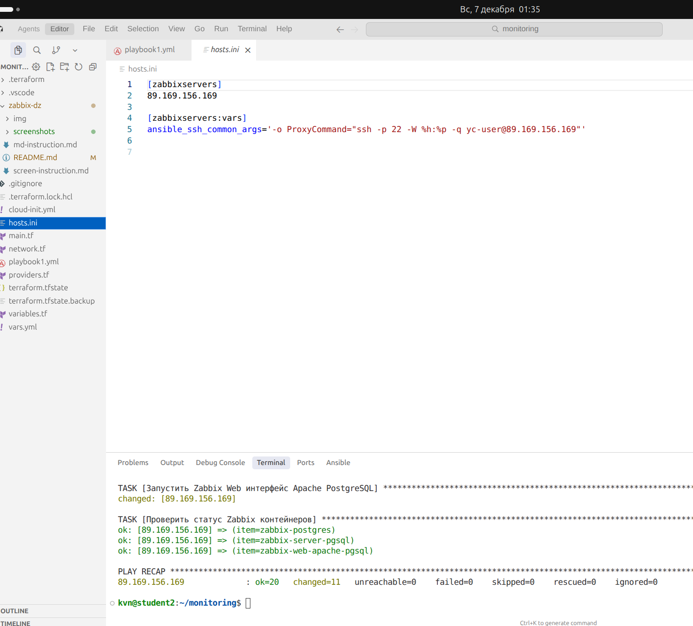
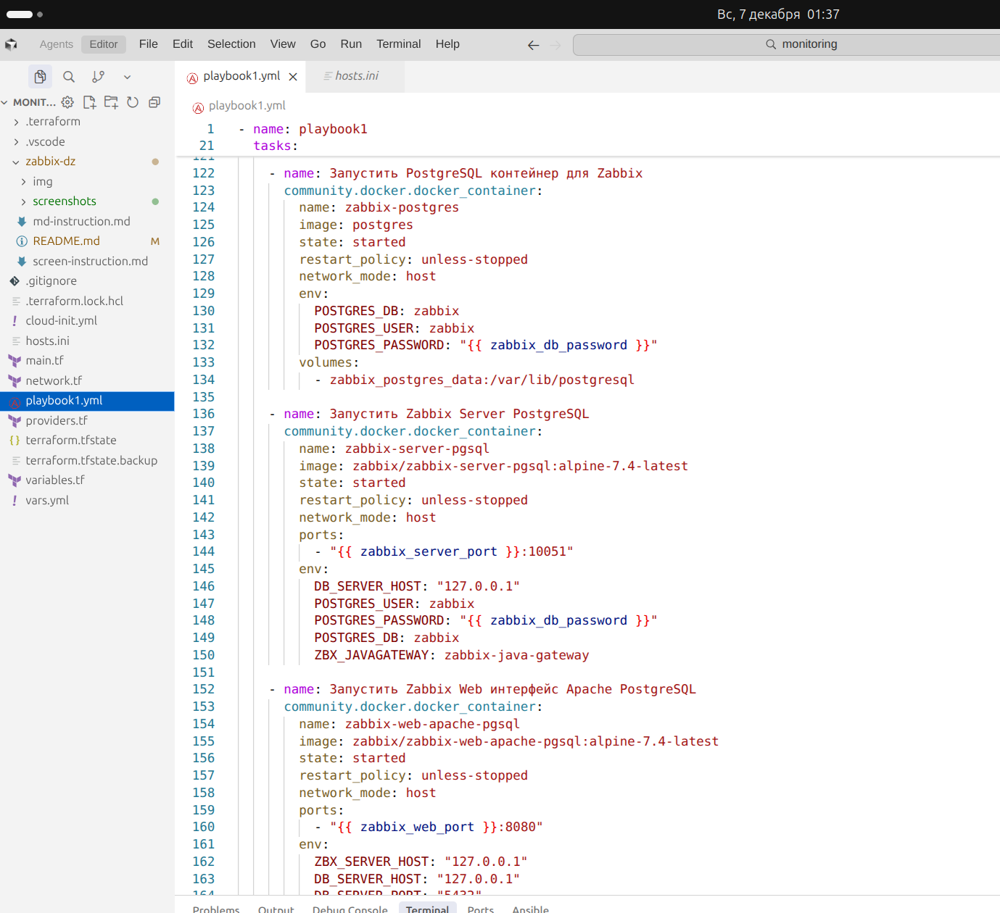
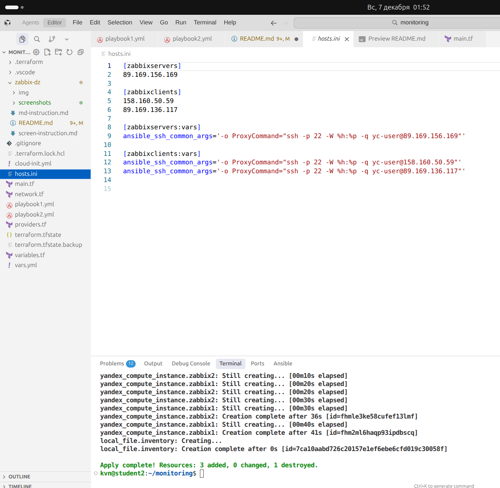
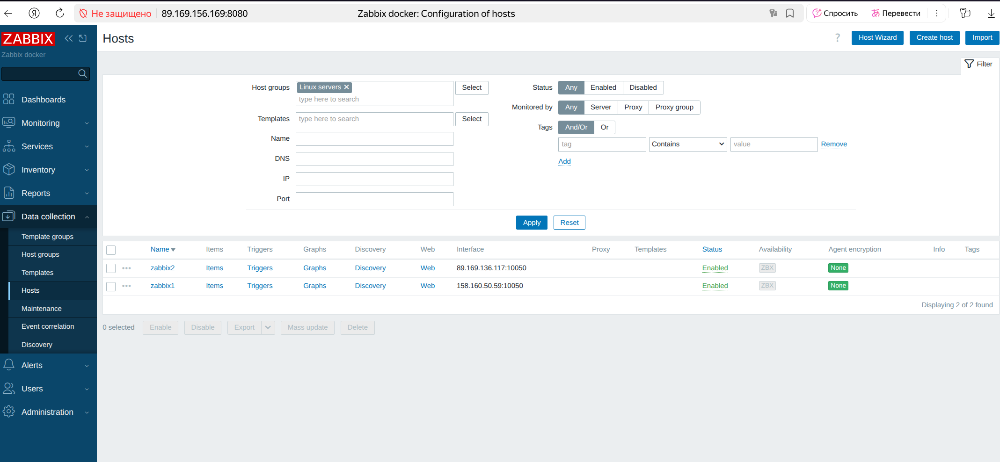
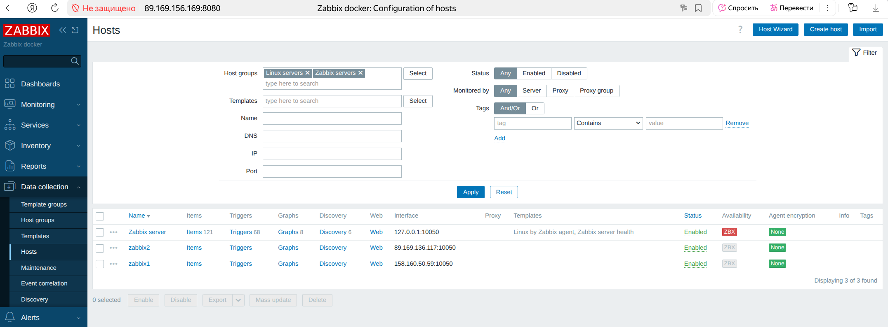
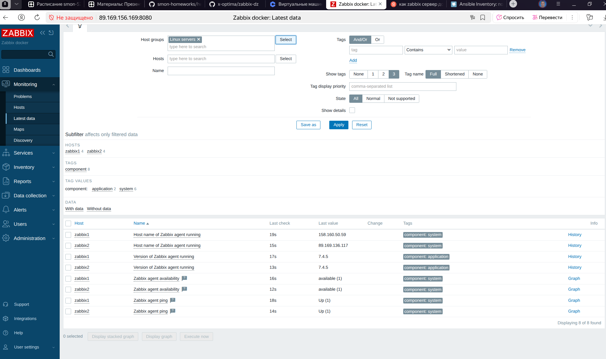

# Домашнее задание к занятию "Система мониторинга Zabbix" - Кучин Виталий

### Инструкция по выполнению домашнего задания

   1. Сделайте `fork` данного репозитория к себе в Github и переименуйте его по названию или номеру занятия, например, https://github.com/имя-вашего-репозитория/git-hw или  https://github.com/имя-вашего-репозитория/7-1-ansible-hw).
   2. Выполните клонирование данного репозитория к себе на ПК с помощью команды `git clone`.
   3. Выполните домашнее задание и заполните у себя локально этот файл README.md:
      - впишите вверху название занятия и вашу фамилию и имя
      - в каждом задании добавьте решение в требуемом виде (текст/код/скриншоты/ссылка)
      - для корректного добавления скриншотов воспользуйтесь [инструкцией "Как вставить скриншот в шаблон с решением](https://github.com/netology-code/sys-pattern-homework/blob/main/screen-instruction.md)
      - при оформлении используйте возможности языка разметки md (коротко об этом можно посмотреть в [инструкции  по MarkDown](https://github.com/netology-code/sys-pattern-homework/blob/main/md-instruction.md))
   4. После завершения работы над домашним заданием сделайте коммит (`git commit -m "comment"`) и отправьте его на Github (`git push origin`);
   5. Для проверки домашнего задания преподавателем в личном кабинете прикрепите и отправьте ссылку на решение в виде md-файла в вашем Github.
   6. Любые вопросы по выполнению заданий спрашивайте в чате учебной группы и/или в разделе “Вопросы по заданию” в личном кабинете.
   
Желаем успехов в выполнении домашнего задания!
   
### Дополнительные материалы, которые могут быть полезны для выполнения задания

1. [Руководство по оформлению Markdown файлов](https://gist.github.com/Jekins/2bf2d0638163f1294637#Code)

---

### Задание 1

Создал в инфраструктуру в Яндекс Облаке при помощи terraform.  
При помощи ansible playbook состоящую из сети, сетевых групп безопасности чтобы открыть порты, одной ВМ - сервера для Zabbix  
Развернул в контейнерах PostgresSQL, Zabbix Server, Zabbix WEB Apache PGSQL.
Web интерфейс zabbix сервера работает на порте 8080.  
Залогинился Admin/zabbix.   

Скриншоты.  

---

### Задание 2

Добавил в main.tf еще два клиента на которые собираюсь установить zabbix агенты.  
Создал playbook2.yml для работы отдельно с клиентами.  
Развернул через контейнеры на обеих машинах zabbix агентов.  
ОТкрыл порт 10050 в network.tf.  

Скриншоты.  

---

### Задание 3

Не выполнено.
